<div align="center">
  
  <h1>APU Chatter</h1>
  <p>Private group social web app — chat, stories, music, voice & more.</p>

  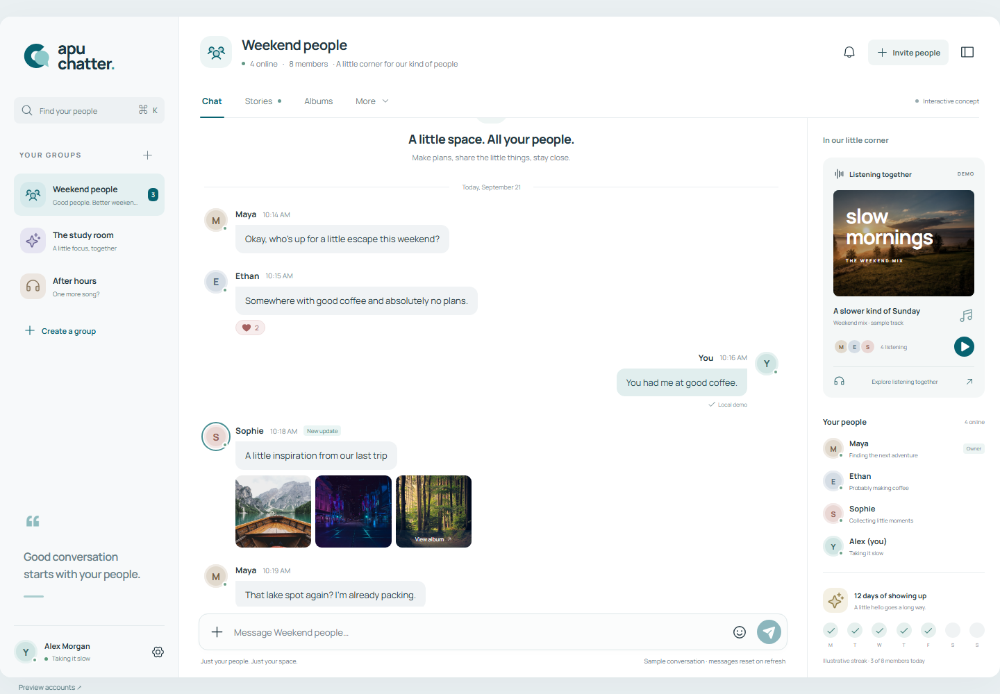
</div>

---

## Overview

APU Chatter is a group-centered web app for small private circles. Each group gets its own chat, stories feed, shared music queue, collaborative whiteboard, voice rooms and AI-powered summaries.

**Preview:** [apu-chatter.pages.dev](https://apu-chatter.pages.dev) (still in development)

## Screenshots

| | Desktop | Mobile |
|---|:---:|:---:|
| Chat | 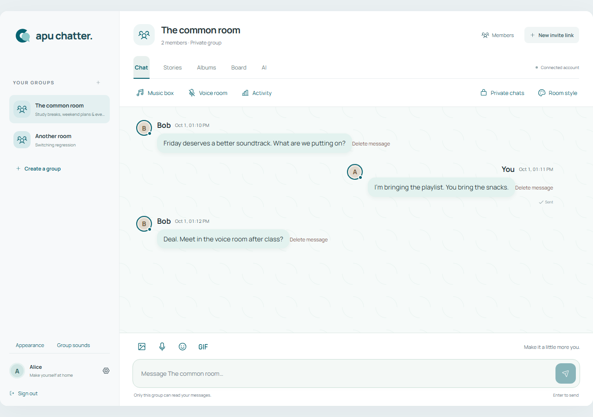 | 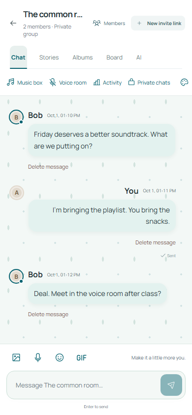 |
| Stories | 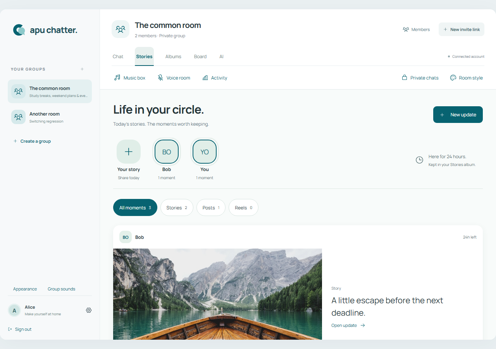 | 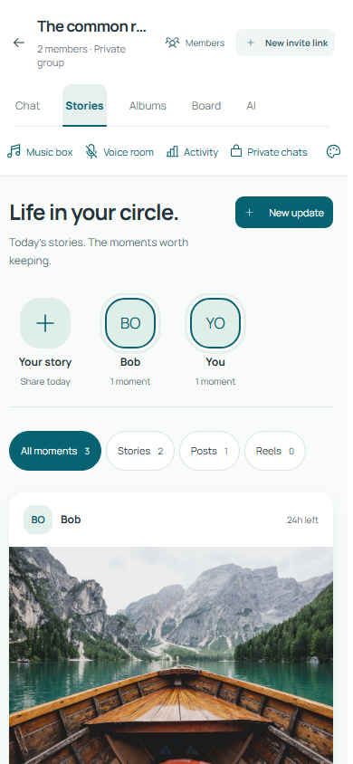 |
| Music | 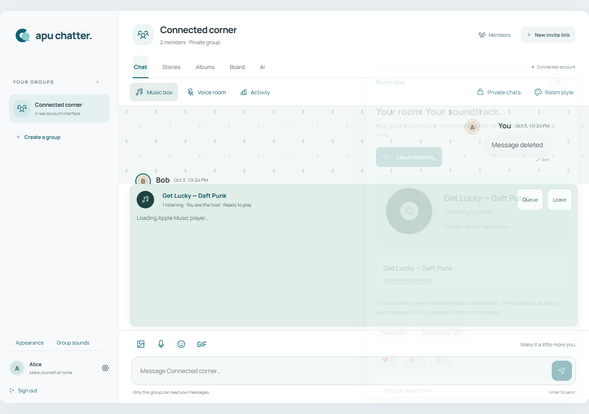 | 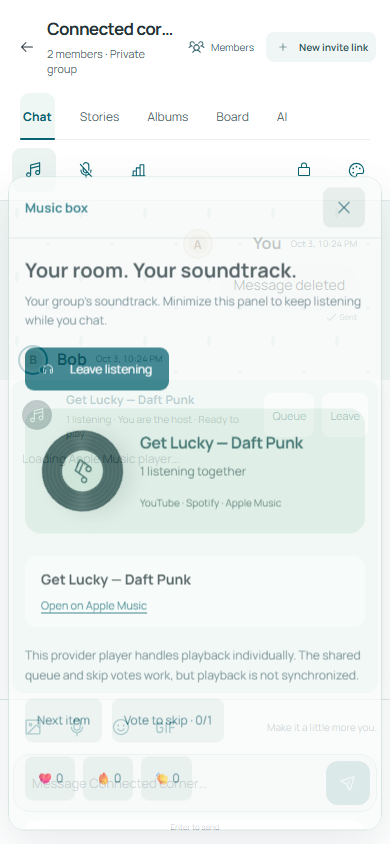 |
| Board | 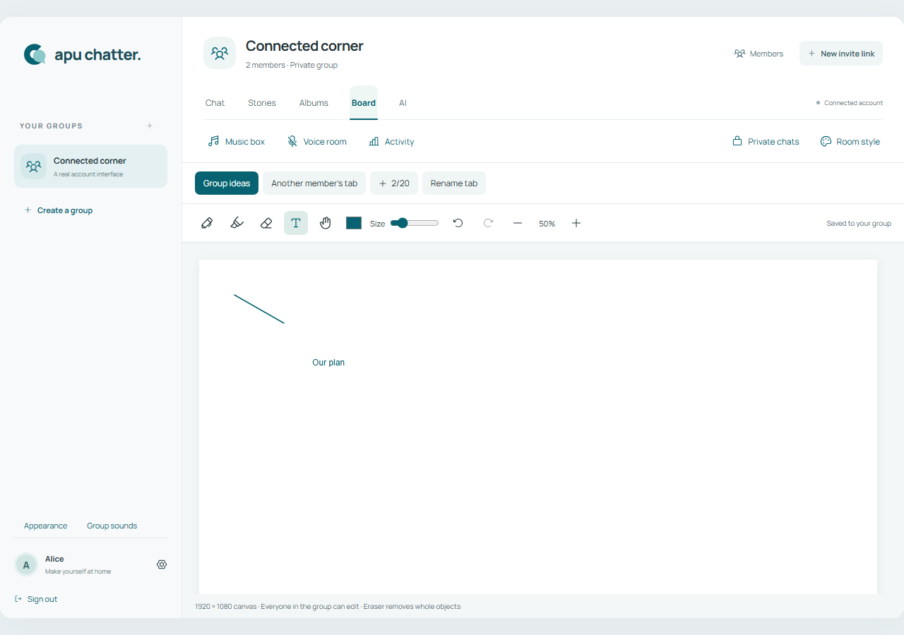 | 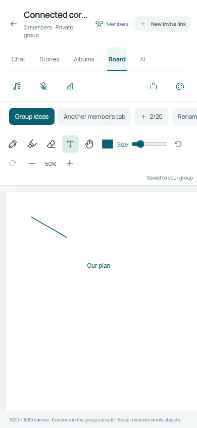 |
| Voice | 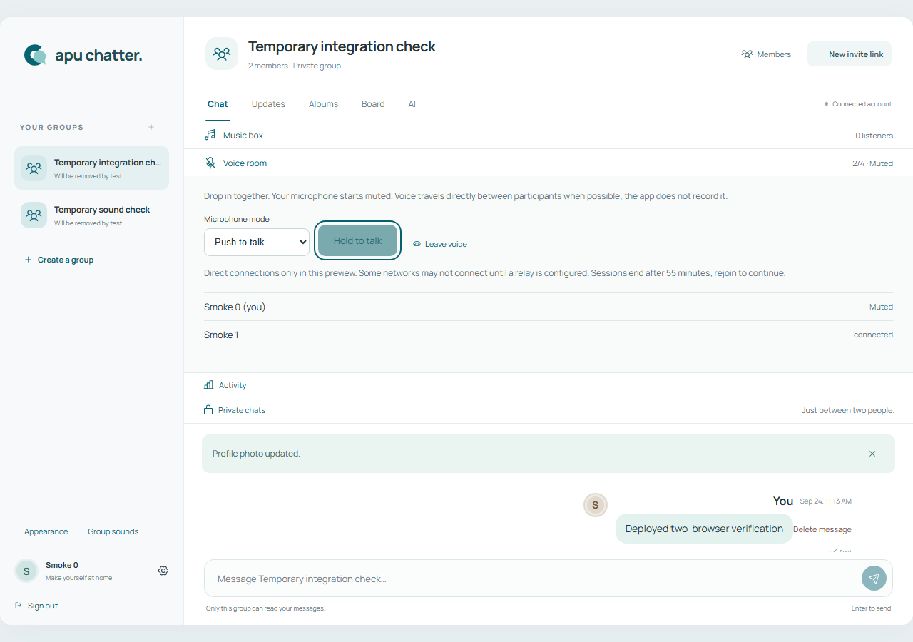 | 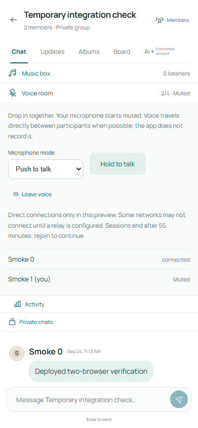 |

## Features

- **Group chat** — real-time messaging, reactions, replies, message deletion
- **Private chats** — temporary 1-on-1 conversations within a group
- **Stories & albums** — posts, reels, stories with media filters and album folders
- **Shared music** — group queue with YouTube, Spotify and Apple Music support
- **Collaborative board** — multi-tab whiteboard with drawing, text and cursor presence
- **Voice rooms** — 4-person WebRTC with push-to-talk and open mic
- **AI summaries** — conversation summaries, weekly topics and group stats
- **Rich composer** — image/GIF uploads, voice messages, emoji picker, dictation
- **Personalization** — visual themes, chat wallpapers, notification sounds
- **Moderation** — roles, kick votes, bans, blocks, reports, QR/link invites

## Tech Stack

| | |
|---|---|
| Frontend | React 19, TypeScript, Vite |
| Backend | Supabase (Auth, Database, Storage, Edge Functions) |
| Real-time | Supabase Realtime, WebRTC |
| Hosting | Cloudflare Pages |

## Getting Started

```bash
npm install
npm run dev
```

Copy `.env.example` to `.env` and add your Supabase project URL and anon key:

```
VITE_SUPABASE_URL=https://your-project.supabase.co
VITE_SUPABASE_ANON_KEY=your-anon-key
```

Build for production:

```bash
npm run build
```

## Project Structure

```
src/
├── app/            — App entry
├── features/
│   ├── auth/       — Login, register, profiles
│   ├── groups/     — Group management, invitations
│   ├── composer/   — Rich message composer
│   ├── sharing/    — Stories, albums, media uploads
│   ├── music/      — Shared music queue & player
│   ├── board/      — Collaborative whiteboard
│   ├── voice/      — WebRTC voice rooms
│   ├── ai/         — AI summaries & song search
│   ├── activity/   — Stats, rankings, streaks
│   └── personalization/
└── lib/            — Shared utilities
supabase/
├── migrations/     — Database schema
└── functions/      — Edge Functions
```

## Docs

- [DESIGN.md](DESIGN.md) — Visual language and UI decisions
- [docs/backend-setup.md](docs/backend-setup.md) — Supabase configuration
- [docs/deployment.md](docs/deployment.md) — Cloudflare Pages deployment
- [docs/release-audit.md](docs/release-audit.md) — Release checklist

## License

Private project. All rights reserved.
